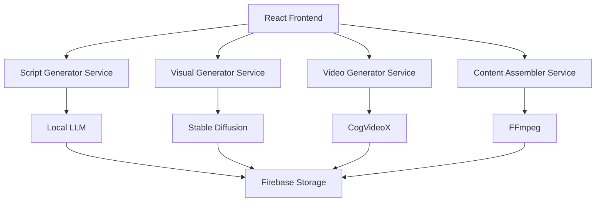
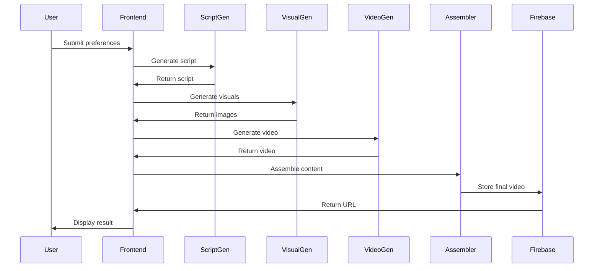

# DreamReel - AI-Powered Short Film Generator

DreamReel is an innovative platform that generates personalized short films (5-10 minutes) using advanced AI technologies. The platform combines various AI models to create custom content based on user preferences.

## Project Overview

DreamReel offers an alternative to traditional streaming services by enabling users to generate personalized short films using AI technologies. Users specify their preferences, and the system creates custom content through a sophisticated AI pipeline:

- LLM for script generation
- Stable Diffusion for visual assets
- CogVideoX for video generation
- ElevenLabs for audio narration

### Technical Architecture

#### Tech Stack

- **Frontend**: React (JavaScript) with React Router and React hooks
- **Backend**: Firebase (Authentication, Firestore, Storage, Functions)
- **AI Processing**: Self-hosted GPU server accessible via ngrok endpoints
- **External APIs**: LLM service, ElevenLabs

#### Core Components

1. **React Application**

   - User authentication and profile management
   - Content creation interface (user preferences collection)
   - Progress tracking and content viewing
   - Community sharing features

2. **Firebase Backend**

   - User data and preferences storage
   - Project documents with generation status
   - Media asset storage (images, audio, video files)
   - Serverless functions to orchestrate the pipeline

3. **Self-hosted GPU Service**

   - Exposed via ngrok for external access
   - Runs resource-intensive AI models locally
   - Job queue system for handling multiple requests
   - Content assembly using FFmpeg

4. **External AI Services**
   - LLM API for script generation
   - ElevenLabs for voice narration

### System Architecture



### Service Flow



### Generation Pipeline

The core innovation of this application is the end-to-end content generation pipeline:

1. **User Input Collection**

   - Genre/mood selection (limited predefined options)
   - Theme input (free text, single field)
   - Visual style selection (visual references)

2. **Script Generation**

   - Template-based prompts for LLM
   - Single-pass script generation for MVP
   - Basic scene structure (3-5 scenes)

3. **Visual Generation**

   - Character sketches generation
   - Environment/background creation
   - Key frame creation for scenes

4. **Video Creation**

   - Standard shot templates
   - Scene building from script and visuals
   - Basic transitions between scenes

5. **Audio Implementation**

   - Default narrator voice
   - Background music based on mood
   - Simple audio layering

6. **Content Assembly**
   - Sequential assembly of scenes
   - Audio-video synchronization
   - Standard output format

### Implementation Priorities

This is an MVP focused on demonstrating the core content generation pipeline for:

- Gathering early user feedback
- Presenting to potential investors
- Validating the concept before scaling

The implementation prioritizes:

- Working end-to-end flow over feature completeness
- Minimal cloud costs using existing GPU infrastructure
- User experience for content creation and viewing
- Foundation that can be expanded as the project develops

### Key Technical Challenges

1. **AI Model Integration**

   - Stable Diffusion for consistent character images
   - CogVideoX for animated scene generation
   - Proper parameter tuning for quality results

2. **Pipeline Orchestration**

   - Handling asynchronous processing steps
   - Managing pipeline state across services
   - Proper error handling and recovery

3. **Content Assembly**

   - Combining generated assets coherently
   - Synchronizing audio with visual elements
   - Creating seamless transitions between scenes

4. **System Scalability**
   - Efficient job queuing for multiple users
   - Resource allocation on GPU machine
   - Firebase quota management

### Future Enhancement Path

After the MVP is validated:

1. Expand customization options
2. Improve content quality through model fine-tuning
3. Add advanced sharing and community features
4. Implement more sophisticated recommendation algorithms
5. Scale infrastructure for higher usage

## The Story So Far...

We've built the initial foundation of DreamReel with:

1. A React frontend that collects user preferences (genre, theme, visual style)
2. A Flask backend service that will handle script generation
3. Basic project structure for future services

## Next Chapter: GPU Server Integration

The next phase involves setting up our Ubuntu GPU server to host all AI services:

1. Local LLM (e.g., Llama 2 or Mistral) for script generation
2. Stable Diffusion for visual asset generation
3. CogVideoX for video generation

### GPU Server Requirements

- Ubuntu 22.04 LTS or later
- CUDA-capable GPU (recommended: NVIDIA RTX 3080 or better)
- 32GB+ RAM
- 1TB+ SSD storage
- ngrok for exposing services

### Services to be Implemented

1. **Script Generator Service**

   - Local LLM integration
   - Prompt engineering for story generation
   - Scene structure generation

2. **Visual Generator Service**

   - Stable Diffusion integration
   - Character and environment generation
   - Style consistency management

3. **Video Generator Service**

   - CogVideoX integration
   - Scene animation
   - Video assembly

4. **Content Assembler Service**
   - FFmpeg integration
   - Audio-video synchronization
   - Final video rendering

## Current Project Structure

```
DreamReel/
├── client/                 # React frontend application
│   ├── src/
│   │   ├── components/    # Reusable React components
│   │   ├── pages/        # Page components
│   │   ├── services/     # API and service integrations
│   │   ├── utils/        # Utility functions
│   │   ├── assets/       # Static assets
│   │   └── styles/       # CSS and styling files
│   └── public/           # Public static files
├── services/             # Backend services
│   ├── script_generator/ # LLM-based script generation
│   ├── visual_generator/ # Stable Diffusion image generation
│   ├── video_generator/  # CogVideoX video generation
│   └── content_assembler/# Content assembly service
└── docs/                 # Project documentation
```

## Next Steps on GPU Server

1. Clone this repository on the Ubuntu GPU server
2. Set up CUDA and required GPU drivers
3. Install and configure local LLM (Llama 2 or Mistral)
4. Set up Stable Diffusion
5. Configure CogVideoX
6. Set up ngrok for service exposure
7. Update environment variables and API endpoints
8. Test the complete pipeline

## Development Setup

### Frontend

```bash
cd client
npm install
npm start
```

### Backend Services

```bash
cd services/script_generator
python3 -m venv venv
source venv/bin/activate
pip install -r requirements.txt
python app.py
```

## Environment Variables

Create `.env` files in each service directory with:

```
# Firebase Configuration
FIREBASE_SERVICE_ACCOUNT_PATH=path/to/service-account.json
FIREBASE_PROJECT_ID=your-project-id
FIREBASE_STORAGE_BUCKET=your-project-id.appspot.com

# Service Ports
SCRIPT_GENERATOR_PORT=5001
VISUAL_GENERATOR_PORT=5002
VIDEO_GENERATOR_PORT=5003
CONTENT_ASSEMBLER_PORT=5004

# GPU Service Configuration
GPU_SERVICE_URL=your-gpu-service-url
GPU_SERVICE_API_KEY=your-gpu-service-api-key
```

## Contributing

Please read CONTRIBUTING.md for details on our code of conduct and the process for submitting pull requests.

## License

This project is licensed under the MIT License - see the LICENSE file for details.
